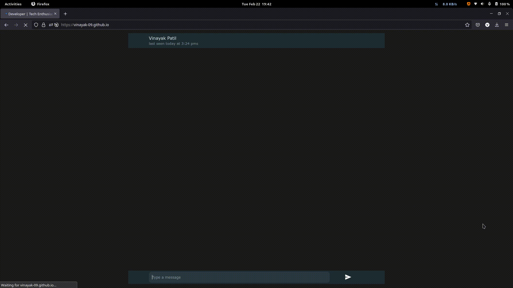

# ChatGPT Assisted Personalied Attractive Advance Portfolio Website

## _ChatGPT API now connected and can imitate me_
Now it supports chatgpt!
## How to deploy it with openai API key
I let chatgpt know my information and let it imitate me.
To use chatgpt function,   change the API key in `./script.js`.
`var OPENAI_API_KEY = "";` lies in around line 23.

You can get the key from https://platform.openai.com/account/api-keys

## How to change the predefined information learned by ChatGPT
If you want to change the predefined text of chatgpt please change in `./script.js`.
`var predefined_text="Can you imitate that you are Pengcheng Xu?...."`lies in around line 10. 

Change the content of it and you will make chatgpt learn the thing you defined in advance!

## _Chatting Bot Like Design (Whatsapp like interface)_
- [Running Site](https://explcre.github.io/chat)

## Technologies Used

- HTML
- Javascript
- CSS

## Features

- ChatGPT API supported
- Whatsapp like interface
- Pleasant sounds
- Lightweighted
- Social media links
- Download resume.
- Map support for address
- Random replies for hi, bye, i love you.

  

## Connect with Me: 

 

 

**Free Software, Hell Yeah!**
